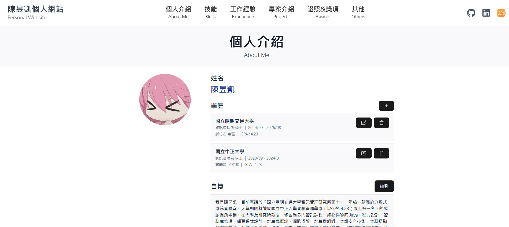

# Personal Website

---

## 概述

建置一個全端的個人作品展示網站，內容包含：

- **首頁**
- **個人介紹 (About)**
- **技能 (Skills)**
- **工作經驗 (Experiment)**
- **專案介紹 (Projects)**
- **獎項 (Award)**
- **其他 (Others)**

透過 RESTful API 串接，實現前後端分離的開發流程。

---

## 使用方式

1. **啟動全部服務**

   ```bash
   npm run start:all
   ```

   > 運行後，打開瀏覽器至 `http://localhost:3000`。

2. **單獨啟動前端**

   ```bash
   npm run start:frontend
   ```

   > 瀏覽器開啟 `http://localhost:3000`。

3. **單獨啟動後端**

   ```bash
   npm run start:backend
   ```

   > 瀏覽器開啟 `http://localhost:8080`。

---

## 技術使用

- **前端**：React、Vite、Tailwind CSS
- **後端**：Java 17、Spring Boot

### 使用版本

| 工具               | 版本      |
| ------------------ | --------- |
| Java               | 17        |
| Spring Boot        | 3.4.4     |
| React              | 19.0.0    |
| Vite               | 6.3.1     |
| Tailwind CSS       | 4.1.4     |

---
## 頁面展示
### 首頁 (Home):


### 個人介紹 (About me):
個人介紹頁面


新增學歷功能


### 技能 (Skill):
技能頁面

新增技能 (Create) 功能視窗

新增欄位按鈕

修改 (Update) 功能視窗

刪除技能、欄位 (Delete) 功能視窗


### 專案 (Project):
專案頁面

新增、修改專案 (Create) 功能視窗

刪除專案 (Delete) 功能視窗

---


## 專案結構

```
personal-site/
├── backend/               # Spring Boot 專案
│   ├── src/main/java/...  # Java 原始碼
│   ├── src/main/resources # application.properties、靜態檔案
│   └── mvnw、pom.xml      # Maven Wrapper 與設定

├── frontend/              # React + Vite 專案
│   ├── src/               # React 元件與頁面
│   ├── index.html
│   ├── vite.config.js
│   └── package.json       # npm 指令與相依套件

└── README.md              # 專案說明文件
```

---

## 開發日誌

### 2025/04/21 (一)

#### 1. 建置後端 Spring Boot

1. 安裝 Spring Boot Extension Pack 插件
2. 打開 VS Code Command Palette (`Ctrl + Shift + P`)
3. 選擇「Spring Initializr: Create a Maven Project」
4. 選取版本 **3.4.4**，語言 **Java**
5. 設定 Group ID 為 `com.example`，Artifact ID 為 `demo`
6. 選擇包裝格式：Jar；Java 版本：17
7. 加入依賴：Spring Boot DevTools、Spring Web、Thymeleaf
8. 將專案儲存至 `backend` 資料夾
9. 建立 `HelloController.java`：

   ```java
   package com.example.demo;

   import org.springframework.web.bind.annotation.GetMapping;
   import org.springframework.web.bind.annotation.RestController;

   @RestController
   public class HelloController {

       @GetMapping("/api/hello")
       public String hello() {
           return "Hello, bro!";
       }
   }
   ```

#### 2. 設定 CORS (允許前端呼叫)

> 此功能可於上線前再開啟。

- **步驟 1：WebConfig.java**

  ```java
  package com.example.demo;

  import org.springframework.context.annotation.Configuration;
  import org.springframework.web.servlet.config.annotation.CorsRegistry;
  import org.springframework.web.servlet.config.annotation.EnableWebMvc;
  import org.springframework.web.servlet.config.annotation.WebMvcConfigurer;

  @Configuration
  @EnableWebMvc
  public class WebConfig implements WebMvcConfigurer {

      @Override
      public void addCorsMappings(CorsRegistry registry) {
          registry.addMapping("/api/**")
                  .allowedOrigins("http://localhost:3000")
                  .allowedMethods("GET","POST","PUT","DELETE","OPTIONS")
                  .allowCredentials(true);
      }
  }
  ```

- **步驟 2：application.properties**

  ```properties
  spring.web.cors.mappings./api/**.allowed-origins=http://localhost:3000,https://your-production-domain.com
  spring.web.cors.mappings./api/**.allowed-methods=GET,POST,PUT,DELETE,OPTIONS
  spring.web.cors.mappings./api/**.allow-credentials=true
  ```

#### 3. 建置前端 React

1. 在根目錄執行：

   ```bash
   npm create vite@latest frontend -- --template react
   cd frontend
   npm install
   ```

2. 修改 `frontend/vite.config.js`：

   ```js
   import { defineConfig } from 'vite';
   import react from '@vitejs/plugin-react';

   export default defineConfig({
     plugins: [react()],
     server: {
       port: 3000,
       proxy: {
         '/api': { target: 'http://localhost:8080', changeOrigin: true },
       },
     },
   });
   ```

3. 編輯 `frontend/src/App.jsx`：

   ```jsx
   import { useEffect, useState } from 'react';

   function App() {
     const [msg, setMsg] = useState('Loading...');

     useEffect(() => {
       fetch('/api/hello')
         .then(res => res.text())
         .then(txt => setMsg(txt))
         .catch(err => setMsg('Error: ' + err.message));
     }, []);

     return (
       <div className="p-8 font-sans">
         <h1 className="text-2xl">{msg}</h1>
       </div>
     );
   }

   export default App;
   ```

#### 4. 一次啟動前後端

1. 安裝 concurrently：

   ```bash
   npm install -D concurrently
   ```

2. 根目錄 `package.json`：

   ```json
   {
     "devDependencies": { "concurrently": "^9.1.2" },
     "scripts": {
       "start:backend": "cd backend/demo && mvnw.cmd spring-boot:run",
       "start:frontend": "cd frontend && npm run dev",
       "start:all": "concurrently \"npm run start:backend\" \"npm run start:frontend\""
     }
   }
   ```

3. 執行 `npm run start:all`，前往 `http://localhost:3000`，應顯示「Hello, bro!」。

#### 5. 安裝並設定 Tailwind CSS

1. 進入 `frontend`：

   ```bash
   npm install tailwindcss @tailwindcss/vite
   ```

2. 更新 `vite.config.js`：

   ```js
   import tailwindcss from '@tailwindcss/vite';

   export default defineConfig({
     plugins: [react(), tailwindcss()],
     server: { proxy: { '/api': 'http://127.0.0.1:8080' } },
   });
   ```

3. 在 `src/index.css` 頂部加入：

   ```css
   @import "tailwindcss";
   ```

4. **選用**：自訂主題

   ```css
   @theme {
     --font-display: "Satoshi", sans-serif;
     --color-primary: #1DA1F2;
   }
   ```

5. **測試**：在 `frontend/src` 下隨便新增一個小檔案 `TailwindTest.jsx`

   ```jsx
   export default function TailwindTest() {
     return (
       <div className="bg-red-500 text-white p-4 m-4">
         <p className="text-xl font-bold">Tailwind 已正確安裝！</p>
       </div>
     );
   }
   ```

6. **測試**：在 `App.jsx` 中引入並渲染 `TailwindTest`

   ```jsx
   // App.jsx
   import { useEffect, useState } from 'react';
   import TailwindTest from './TailwindTest';   // ① 引入

   function App() {
     const [msg, setMsg] = useState('Loading...');

     useEffect(() => {
       fetch('/api/hello')
         .then(res => res.text())
         .then(txt => setMsg(txt))
         .catch(err => setMsg('Error: ' + err.message));
     }, []);

     return (
       <>                                        {/* ② 用 Fragment 包起來 */}
         <div style={{ padding: '2rem', fontFamily: 'sans-serif' }}>
           <h1>{msg}</h1>
         </div>
         <TailwindTest />                        {/* ③ 在這裡渲染 */}
       </>
     );
   }

   export default App;
   ```

7. **測試**：執行`npm run start:all`，然後到瀏覽器(http://localhost:3000)去確認是否有出現「Hello,bro」以及「紅框白字的 Tailwind 已正確安裝！」

### 2025/04/23 (三)
#### 1. 安裝 react-router
```
cd frontend
npm install react-router-dom@6
```
設定 `app.jsx`

#### 2. 建置`components`中的`Navbar`
導覽列:能夠隨頁面往下時跟著往下


#### 3. 建置 `pages`中的`Home.jsx`
首頁的Carousel功能，可以左右切換


### 2025/04/26 (六)
#### 1. Skill 前端頁面設計
預想功能 : 
- 新增欄位(如:程式設計)
- 欄位內可以新增技能 (如:Python)
- 可以修改及刪除欄位、技能
- 利用視窗處理

#### 2. 進行 PostgreSQL 資料庫建置
建置 + Postman 測試

#### 3. 進行後端 CRUD 功能設計
分為兩部分 : Category(欄位)、Skill(功能)
並利用 JPA + Hibernate 管理資料庫

#### 4. 將前後端以 Restful API 串接起來

#### 5. 微調前端
設定視窗背景等...


### 2025/05/02 (五)
#### 1. 首頁新增簡單個人介紹部分
1. 左邊文字說明、右邊圖片設計
2. 歡迎字體從左到右動畫特效 (安裝`npm framer-motion`)
3. Read more 的 Hover 反白效果


### 2025/05/04 (日)
#### 1. 首頁新增技能卡片區域
1. 設計能夠取得技能欄位名稱與技能
2. 設計卡片顯示方式，固定出現四個卡片，並且固定大小會出現4個技能
3. 設計按鈕可以循環式觀看
4. 會隨著技能頁面而有所變化
5. 查看技能按鈕會導覽至技能頁面


#### 2. 稍微改寫首頁自我介紹區域
1. 改成圖片在直接定位在最右邊

### 2025/05/08 (四)
#### 1. 完成個人介紹頁面
其中包括 :
- 左邊的一個大頭貼
- 右邊的姓名、學歷、自傳
- 學歷的新增、修改、刪除功能
- 自傳的編輯功能
- 自傳看更多


#### 2. 完成 AOP 功能
可以看用了什麼功能、參數等


### 2025/05/09
#### 1. 完成專案頁面

其中包括 :
- 新增專案
- 可以新增專案名稱、說明、技術、連結、圖片等
- 修改專案

- 刪除專案


#### 2. 新增首頁專案部分
